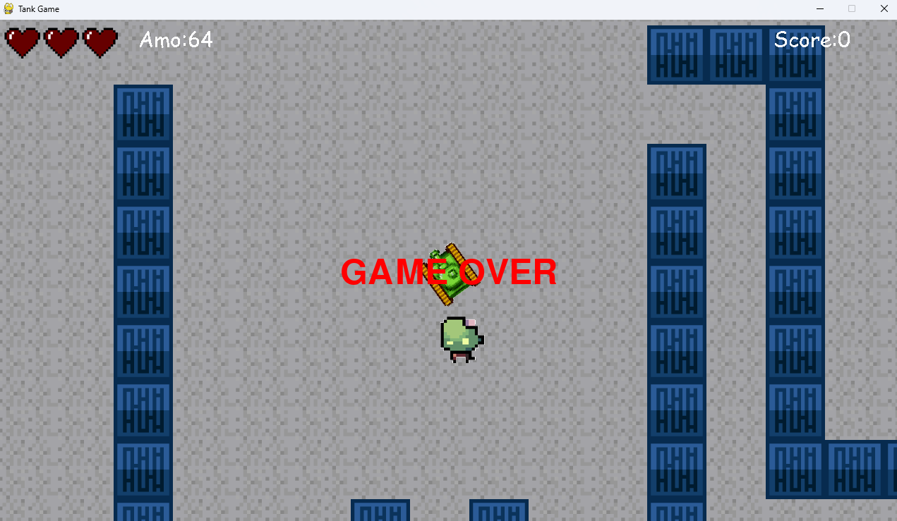

# 🌟 Game Tank 🌟

## 🌐 Description

**Game Tank** is an exciting arcade-style game where players control a tank and navigate through a maze filled with obstacles and enemies. The goal is to survive as long as possible, collecting ammunition and eliminating zombies that come towards the tank.

## 💡 Features

- **Tank Control**: Players can control the tank using the keyboard to navigate through the maze.
- **Ammunition**: Players can collect ammunition from the map and shoot zombies to eliminate them.
- **Zombies**: Enemies are continuously generated and move towards the tank. Zombies are capable of avoiding obstacles to reach the player.
- **Lives System**: The tank has a limited number of lives represented by hearts. If a zombie touches the tank, the player loses lives. The game ends when all lives are lost.
- **Score Saving**: At the end of each game, players can choose to save their score and enter their name. Scores are saved in a file and can be viewed from the menu.
- **Level Menu**: The game includes a level selection menu where players can choose from multiple available maps.
- **Scoreboard Menu**: Players can view the leaderboard from a dedicated menu.

## 🟢 Installation

1. **Clone the repository**:
    ```sh
    git clone https://github.com/sergiu1301/TankGame.git
    ```

2. **Install dependencies**:
    Make sure you have Python and pygame installed. If not, you can install pygame using pip:
    ```sh
    pip install pygame
    ```

3. **Run the game**:
    ```sh
    python main.py
    ```

## ⚡ Controls

- **Tank Movement**: 
    - `W`: Move forward
    - `S`: Move backward
    - `A`: Rotate left
    - `D`: Rotate right
- **Shooting**:
    - `SPACE`: Shoot

## 🛡️ Project Structure

- **main.py**: Entry point of the game.
- **game.py**: Contains the main game logic.
- **menu.py**: Manages the level selection menu and scoreboard menu.
- **level.py**: Manages levels and map generation.
- **tank.py**: Defines the behavior of the tank.
- **zombie.py**: Defines the behavior of the zombies.
- **ammunition.py**: Manages the ammunition objects.
- **settings.py**: Contains game settings and maps.
- **heart.py**: Defines the behavior of the hearts.
- **tile.py**: Defines the behavior of the tiles.
- **explosion.py**: Defines the behavior of the explosions.
- **bullet.py**: Defines the behavior of the bullets.
- **debug.py**: Contains debug setup.
- **floor.py**: Defines the behavior of the floor.
  
## Screenshots

### Main Menu


### Scoreboard


### Gameplay


### Game Over

